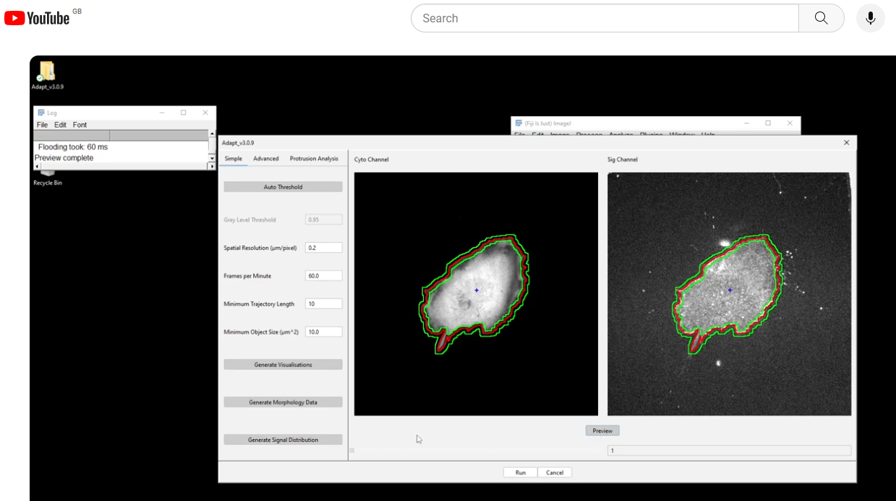

   

# ADAPT

ADAPT (**A**utomated **D**etection and **A**nalysis of **P**ro**T**rusions) is a plug-in developed for the [ImageJ/FIJI](http://fiji.sc/) platform to automatically detect and analyse cell migration and morphodynamics. The program provides whole-cell analysis of multiple cells, while also returning data on individual membrane protrusion events.

## Cite

If you use ADAPT in your research, please cite the following publication:

David J. Barry, Charlotte H. Durkin, Jasmine V. Abella, Michael Way; Open source software for quantification of cell migration, protrusions, and fluorescence intensities. _J Cell Biol_ 2015; 209 (1): 163–180. doi: https://doi.org/10.1083/jcb.201501081

## Get Started

View the below tutorial on YouTube to get started with some [test data](https://github.com/djpbarry/Adapt/tree/master/test_data).

For more detailed instructions on installation and usage, consult [the wiki](https://github.com/djpbarry/adapt/wiki).
